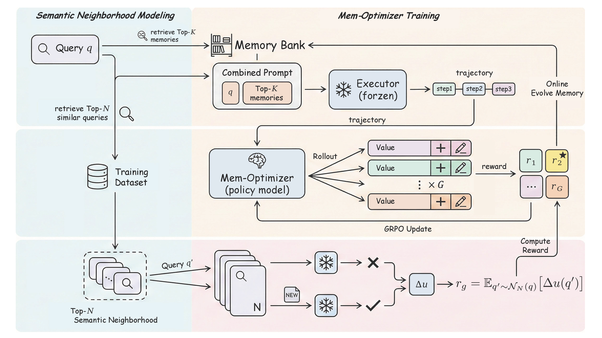
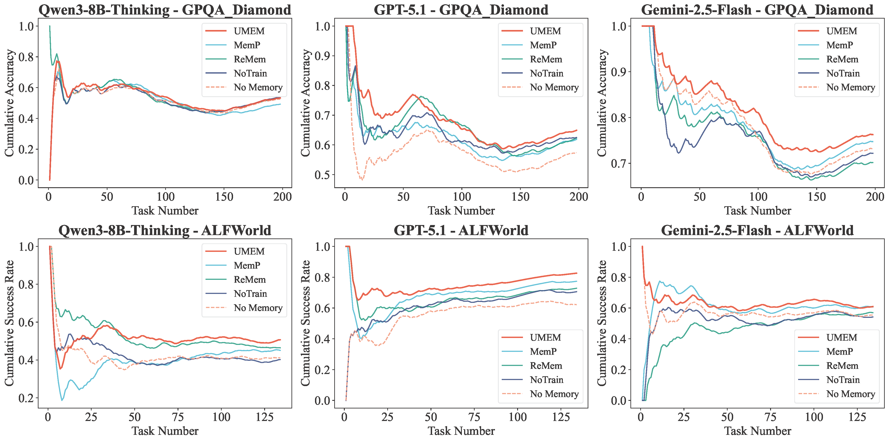

# 🌟 Marco DeepResearch Family

<div align="center">

🍓 [_**Alibaba International Digital Commerce**_](https://aidc-ai.com) 🍓

[English](README.md) | [简体中文](README_zh.md)

</div>

---

## Overview

The **Marco DeepResearch Family** encompasses a comprehensive suite of benchmarks and frameworks addressing distinct challenges in real-world agent systems. From hierarchical rule application to large-scale information seeking and self-evolving memory, our work bridges fundamental research with practical deployment needs.

---

## 📑 [HSCodeComp](../HSCodeComp/README.md)

**Evaluating Hierarchical Rule Application in E-Commerce Domain**

<div align="center">
  
</div>

### Challenge

Apply complex hierarchical tariff rules with vague language and implicit decision logic to predict 10-digit Harmonized System (HS) Codes from noisy product listings.

### Key Statistics

- 📊 **632** expert-annotated products across 27 HS chapters and 32 e-commerce categories
- 🎯 **10-digit** HS Code prediction from noisy product listings
- 👨‍💼 **Human Expert Performance**: 95.0% accuracy
- 🤖 **Best AI System** (SmolAgent + GPT-5 VLM): 46.8% accuracy
- ⏱️ **Human Annotation Cost**: >$34/hour with domain experts

### Impact

Reveals critical limitations in agents' ability to handle hierarchical reasoning in vertical domains (law, medical, customs, taxation).

### Resources

- 📝 [Paper](https://arxiv.org/abs/2510.19631) | 🤗 [Dataset](https://huggingface.co/datasets/AIDC-AI/HSCodeComp) | 📘 [Documentation](HSCodeComp/README.md)

---

## 🌐 [DeepWideSearch](../DeepWideSearch/README.md)

**Evaluating Deep-and-Wide Agentic Information Seeking**

<div align="center">
  
</div>

### Challenge

Simultaneously discover large volumes of entities (wide) and perform deep multi-hop reasoning for each entity (deep) to produce structured tables (entities × attributes).

### Key Statistics

- 📊 **220** complex queries requiring structured table outputs (entities × attributes)
- 🔢 **414** average information units per answer
- 🧠 **4.21** average reasoning depth (multi-hop steps)
- 🌍 Bilingual evaluation: **English & Chinese**
- 🤖 **Best AI System** (WebSailor + Claude Sonnet 4): 2.39% success rate
- 📈 **Adopted by A-MapReduce** (Fudan University) as primary evaluation benchmark

### Impact

Demonstrates that even state-of-the-art agents struggle with combining wide exploration and deep reasoning at scale.

### Resources

- 📝 [Paper](https://arxiv.org/abs/2510.20168) | 🤗 [Dataset](https://huggingface.co/datasets/AIDC-AI/DeepWideSearch) | 📘 [Documentation](DeepWideSearch/README.md)

---

## 📊 [Table-as-Search](../Table-as-Search/README.md)

**Hierarchical Multi-Agent Framework for Deep and Wide Information Seeking**

<div align="center">
  
</div>

### Challenge

Build a production-ready agent framework that excels at both deep reasoning over multi-hop retrieval and wide-scale information collection across multiple entities.

### Key Innovation

Hierarchical multi-agent architecture with specialized search strategies that significantly outperforms single-agent and multi-agent ReAct baselines.

### Performance Highlights

<div align="center">
  <table>
    <tr>
      <td width="50%">
        
        <p align="center"><em>WideSearch Benchmark (189 samples)</em></p>
      </td>
      <td width="50%">
        
        <p align="center"><em>DeepSearch Benchmark (BrowseComp-ZH)</em></p>
      </td>
    </tr>
  </table>
  <p><em>Performance comparison showing the <strong>"scissor gap effect"</strong>: Table-as-Search maintains superior performance even as task difficulty increases, with the advantage widening on harder tasks.</em></p>
</div>

### Architecture Components

- 🎭 **Main Agent**: Task decomposition and orchestration
- 📊 **Tabular Search Agent**: Wide-scale entity collection
- 🔎 **Deep Search Agent**: Multi-hop attribute extraction
- 🛠️ **Tool Ecosystem**: Google Search, Web visiting, Database-backed tables

### Key Results

- ✅ **Consistent superiority** across all difficulty levels (Easy → Very Hard)
- ✅ **Widening performance gap** on harder tasks compared to baselines
- ✅ **Production-ready** with parallel processing, timeout management, and state persistence
- ✅ **Fair comparison** using Gemini 2.5 Flash for all methods

### Resources

- 📝 [Paper](https://arxiv.org/abs/2602.06724) | 🔧 [Framework Code](Table-as-Search/) | 📘 [Documentation](Table-as-Search/README.md)

---

## 🧠 [UMEM](../UMEM/README.md)

**Unified Memory Extraction and Management for Generalizable Self-Evolving Memory**

<div align="center">
  
</div>

### Challenge

Build self-evolving agent memory systems that avoid the **"Rote Memorization" trap**—preventing accumulation of instance-specific shortcuts and noise that degrade generalization.

### Key Innovation

**Joint optimization** of memory extraction and management through a learned Mem-Optimizer policy that explicitly optimizes for cross-query generalization.

<div align="center">
  
</div>

### Core Components

- 🔒 **Frozen Executor**: LLM/agent that solves tasks with retrieved memories
- 💾 **Evolvable Memory Bank**: Non-parametric key-value store updated over time
- 🎯 **Mem-Optimizer Policy**: Learned policy that outputs structured memory actions (ADD/UPDATE)

### Technical Highlights

- 🔬 **Semantic Neighborhood Modeling (SNM)**: Constructs semantic neighborhoods to evaluate memory updates across related queries
- 📊 **Marginal Utility Reward**: Neighborhood-level reward that optimizes for generalization
- 🔄 **GRPO + Online Evolution**: Commits best-reward actions to memory bank during training
- 📝 **Strict XML Schema**: Enforces format constraints to prevent answer leakage and hallucination

### Performance

- ✅ **Prevents overfitting** to single instances through neighborhood-level optimization
- ✅ **Generalizable memories** that transfer across semantically related queries
- ✅ **Efficiency gains** through trajectory length reduction while preserving correctness
- ✅ **Cumulative improvement** in streaming evaluation protocol

<div align="center">
  
  <p><em>Cumulative performance showing continuous improvement through self-evolution</em></p>
</div>

### Resources

- 📝 Paper (Coming Soon) | 🔧 [Framework Code](UMEM/) | 📘 [Documentation](UMEM/README.md)

---

## 🔗 Related Resources

### Benchmarks & Datasets

| Project | HuggingFace | GitHub | Paper |
|---------|-------------|--------|-------|
| **HSCodeComp** | [🤗 Dataset](https://huggingface.co/datasets/AIDC-AI/HSCodeComp) | [📁 Data](HSCodeComp/data/) | [📝 arXiv](https://arxiv.org/abs/2510.19631) |
| **DeepWideSearch** | [🤗 Dataset](https://huggingface.co/datasets/AIDC-AI/DeepWideSearch) | [📁 Data](DeepWideSearch/data/) | [📝 arXiv](https://arxiv.org/abs/2510.20168) |
| **Table-as-Search** | — | [📁 Code](Table-as-Search/) | [📝 arXiv](https://arxiv.org/abs/2602.06724) |
| **UMEM** | Coming Soon | [📁 Code](UMEM/) | Coming Soon |

### Benchmark Adoption

Our benchmarks are being actively used by leading research institutions:

- **🎓 A-MapReduce (Fudan University)**: Adopted **DeepWideSearch** as the primary evaluation benchmark for wide-scope agentic search systems, achieving 79.09% Core Entity Accuracy and 4.43% Success Rate. [📄 Paper](https://arxiv.org/pdf/2602.01331)

---

## 📊 Performance Summary

### Hierarchical Rule Application
- **HSCodeComp**: 48.2% performance gap between human experts (95.0%) and best AI (46.8%)
- Demonstrates critical need for improved hierarchical reasoning in vertical domains

### Deep-Wide Information Seeking
- **DeepWideSearch**: Current SOTA achieves only 2.39% success rate on complex structured retrieval
- **Table-as-Search**: 40%+ improvement on hard tasks through table-centric design

### Self-Evolving Memory
- **UMEM**: Prevents rote memorization while maintaining cumulative performance improvement
- Generalizable memory that transfers across semantic neighborhoods

---

## 🎯 Research Directions

Our family of benchmarks and frameworks identifies and addresses key challenges:

1. **Hierarchical Decision-Making**: Moving beyond flat reasoning to handle nested rules and constraints
2. **Scale + Depth Trade-offs**: Balancing wide exploration with deep multi-hop reasoning
3. **Structured Information Management**: Organizing large-scale retrieval results effectively
4. **Generalizable Long-Term Memory**: Learning from experience without instance-specific overfitting

---

## 👨🏻‍💻 Contact

Main contributors are from AI Business, Alibaba International Digital Commerce. For questions or collaboration:
- [Tian Lan](https://github.com/gmftbyGMFTBY)
- [Longyue Wang](https://www.longyuewang.com/)

---

## 📬 Citation

If you find our work useful, please cite the relevant papers:

```bibtex
@article{lan2024hscodecomp,
  title={HSCodeComp: Evaluating Hierarchical Rule Application in E-Commerce Domain},
  author={Lan, Tian and Wang, Longyue and others},
  journal={arXiv preprint arXiv:2510.19631},
  year={2024}
}

@article{lan2024deepwidesearch,
  title={DeepWideSearch: Benchmarking Depth and Width in Agentic Information Seeking},
  author={Lan, Tian and Wang, Longyue and others},
  journal={arXiv preprint arXiv:2510.20168},
  year={2024}
}

@misc{lan2026tableassearch,
  title={Table-as-Search: Formulate Long-Horizon Agentic Information Seeking as Table Completion}, 
  author={Tian Lan and Felix Henry and Bin Zhu and Qianghuai Jia and Junyang Ren and Qihang Pu and Haijun Li and Longyue Wang and Zhao Xu and Weihua Luo},
  year={2026},
  eprint={2602.06724},
  archivePrefix={arXiv},
  primaryClass={cs.CL},
  url={https://arxiv.org/abs/2602.06724}, 
}

@misc{ye2026umemunifiedmemoryextraction,
      title={UMEM: Unified Memory Extraction and Management Framework for Generalizable Memory}, 
      author={Yongshi Ye and Hui Jiang and Feihu Jiang and Tian Lan and Yichao Du and Biao Fu and Xiaodong Shi and Qianghuai Jia and Longyue Wang and Weihua Luo},
      year={2026},
      eprint={2602.10652},
      archivePrefix={arXiv},
      primaryClass={cs.CL},
      url={https://arxiv.org/abs/2602.10652}, 
}
```
