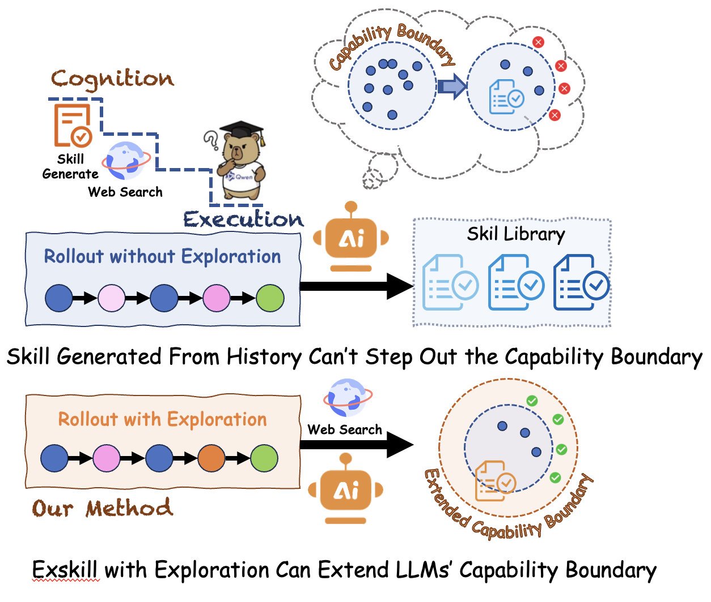
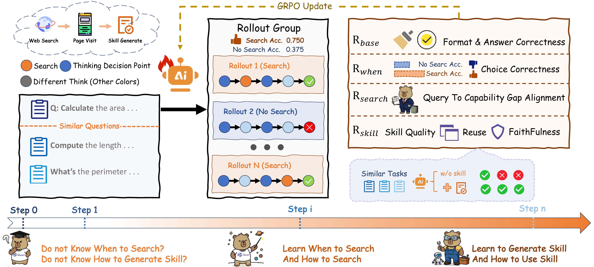
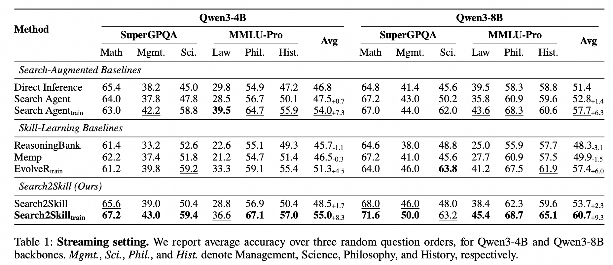
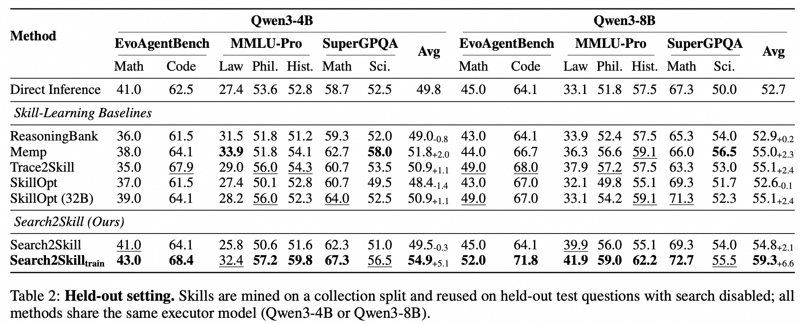

# Search2Skill: Skill Distillation Beyond Knowledge Boundaries via Rubric-Based Reinforcement Learning

<div align="center">

[](../../LICENSE) [](../../assets/Search2Skill-20260804-v1-arxiv.pdf) []()

⭐ _**MarcoPolo Team**_ ⭐

[_**Alibaba Group**_](https://www.qianwenai.com/)

 [**GitHub**](https://github.com/AIDC-AI/Marco-DeepResearch/tree/main/Marco-DeepResearch-Family/Search2Skill) 📝 [**Paper (Preview PDF)**](../../assets/Search2Skill-20260804-v1-arxiv.pdf)

</div>

---

> [!IMPORTANT]
> **🚧 Code will be released.** This repository is a placeholder for the official implementation of Search2Skill. Star or watch the repo to get notified.

---

## 📌 Overview

**Search2Skill** is a search-driven, self-evolving skill framework that lets an LLM agent acquire *reusable skills* for expert domains by looking **outward** to external sources, instead of only recycling its own trajectories.

Most prior self-evolving skill methods are **inward-looking**: they distill skills from the agent's parametric knowledge and past execution traces, and are therefore bounded by what the model already knows. But the skills that matter in professional domains — domain conventions, standard procedures, practical expert experience — often lie *exactly beyond* that boundary.

<p align="center"></p>

Search2Skill closes the loop among **capability-gap identification → external search → skill distillation**:

- the agent reasons with its parametric knowledge and skill library, and upon identifying a **capability gap**, enters an *exploration state*;
- it formulates targeted queries, gathers evidence from external sources, and **distills it into a structured skill**;
- the skill is written back into a persistent library and reused for the current *and* future related tasks.

Crucially, the agent must jointly learn **when to search**, **how to search**, and **how to distill skills**; without optimization it misjudges when search is needed, retrieves irrelevant or biased evidence, or produces skills that are unfaithful to the evidence and overly instance-specific. Search2Skill therefore trains the whole loop with a **rubric-based RL** objective.

<p align="center"></p>

---

## 🔥 News

* [2026/08] 🎉 Paper preview (PDF) released — see [Search2Skill-20260804-v1-arxiv.pdf](../../assets/Search2Skill-20260804-v1-arxiv.pdf). Code coming soon.
* [2026/08] Project page is up. Paper and code coming soon.

---

## 🧠 Method

### Agent Loop

Each task pairs an input question with a **persistent skill library**. Relevant skills are retrieved and injected into context, after which the agent interleaves reasoning with one of three actions per step:

- **Search** — issue a web search or visit a page, triggered when the agent identifies a capability gap;
- **Skill generation** — distill the gathered evidence into a structured skill and write it back to the library;
- **Final answer** — terminate the rollout.

If no gap is identified, the rollout degenerates to standard reasoning-and-answering. When one is, the distilled skill persists in the library and is reused on future related tasks — unlike ordinary search-augmented answering, which must re-search from scratch every time.

### Rubric-Based Rewards

A single outcome reward cannot tell *which* of the three coupled decisions went wrong. Search2Skill therefore adds one rubric reward per decision, on top of a task term for answer correctness and action format:

- **When to search** — exploration necessity is judged *relatively* within each rollout group: rollouts are split into exploring and direct-answering subsets, and the decision bonus goes only to the strategy that clearly wins by a margin. This discourages both unnecessary exploration and over-confident direct answering.
- **How to search** — a rubric LLM judge rates the issued queries on **query abstraction** (targeting reusable principles rather than instance specifics or vague topics) and **evidence gain**; poorly-posed queries are penalized, so a skill reached through bad queries earns little.
- **How to distill** — an execution-based **reuse** score (the skill's accuracy gain on similar questions over direct reasoning) combined with a rubric **grounding** score (faithfulness to the retrieved evidence rather than hallucination from parametric memory).

The three terms compose through a **gate**: exploration necessity decides *whether* a rollout earns a decision bonus, while search and skill quality decide *how large* it is. Gating quality behind a demonstrated capability gap calibrates the decision to search without encouraging indiscriminate exploration. Full formulations are given in the paper.

### Training

- **SFT cold start** — ~8K rejection-sampled trajectories from teacher models running the full Search2Skill loop, covering both exploration and direct-answer behaviors.
- **Rubric GRPO** — ~2K filtered anchor questions the student consistently fails, each paired with 3 semantically similar questions for **online skill-reuse** scoring; group size $N = 16$, tool observations kept in context but masked out of the loss.

---

## 🗃️ Skill Format

Each skill is a JSON object with a standardized schema; the source question is stored as retrieval-only metadata.

```xml
<GENERATE_SKILL>{
  "skill_name": "name_with_underscores",
  "use_when": "when to activate this skill -- describe the problem type or scenario",
  "workflow": "step-by-step workflow, distilled facts, formulas, constants from page content (or empty string)",
  "code": "reusable Python `def` functions (or empty string)"
}</GENERATE_SKILL>
```

`workflow` holds distilled facts, formulas and procedures; `code` holds only parameterized, self-contained `def` functions, loaded as a library into the sandboxed Python tool. Every factual claim must be grounded in a visited page — omit rather than guess.

Retrieved skills are first shown only by `skill_name` + `use_when`; the `workflow` and `code` are revealed after the agent explicitly activates a skill. Retrieval mixes description similarity with source-question similarity (top-$k$ = 3), and the library is capped with no merging or rewriting, so quality gains come from better *generation* rather than post-hoc curation.

---

## 🧪 Evaluation

Two complementary protocols over 8 expert-level domains from **SuperGPQA** (Math, Management, Science), **MMLU-Pro** (Law, Philosophy, History), and **EvoAgentBench** (OmniMath, LiveCodeBench):

- **Streaming** — questions arrive as a sequential stream; skills distilled from earlier questions become immediately available to later ones (averaged over three random orders).
- **Held-out** — each domain is split 2:1 into a collection set for skill mining and a test set; the frozen library is reused on the test set **with search disabled**.

### Streaming Setting

<p align="center"></p>

Search2Skill<sub>train</sub> improves over Direct Inference by **+8.3%** (Qwen3-4B) and **+9.3%** (Qwen3-8B), beating the RL-trained search agent (+1.0 / +3.0) and the RL-trained self-evolving memory baseline EvolveR<sub>train</sub> (+3.7 / +3.3). Trajectory-based methods (ReasoningBank, Memp) even fall *below* Direct Inference on average.

### Held-out Setting (search disabled at test time)

<p align="center"></p>

Even with the library frozen and web access removed, the distilled skills carry **+5.1%** / **+6.6%** over Direct Inference, showing intrinsic reusability rather than a live-search effect.

### Further Findings

- **Abstraction, not caching.** Reusing the *same* gathered information as raw retrieved evidence yields only +1.8%, whereas reusing the abstracted skills distilled from it yields +6.3% — a **+4.5%** margin for abstraction.
- **Cross-model transfer.** A library mined once by the RL-trained 8B collector improves a smaller 4B executor by +4.1% and a larger 14B executor by +3.5%, outperforming all corresponding baselines: the encoded knowledge is not model-specific.
- **RL repairs the whole pipeline.** Across five failure patterns (missed search trigger, poor query, formatting error, insufficient skill coverage, skill hallucination), rubric-RL reduces the average failure share from 25.3% to 11.9%.
- **Rewards are complementary.** Ablating any rubric reward degrades accuracy; dropping the exploration-necessity term hurts most, pushing the search rate to 96.6% and producing low-quality skills that pollute the library.
- **Sample efficiency.** Search2Skill reaches higher accuracy after a fraction of the collection set, while inward-looking baselines fluctuate around their initial accuracy over a full run.

---

## 🛡️ License

This project is licensed under the **Apache-2.0 License**. See [LICENSE](../../LICENSE) for details.

---

## 📖 Citation

If you find Search2Skill useful in your research, please cite (entry will be updated once the paper is public):

```bibtex
@misc{ye2026search2skill,
      title={Search2Skill: Skill Distillation Beyond Knowledge Boundaries via Rubric-Based Reinforcement Learning},
      author={Muyang Ye and Tian Lan and Feihu Jiang and Yongshi Ye and Wuyunsiqin and Bin Zhu and Qianghuai Jia and Zhao Xu and Weihua Luo and Ye Wang and Jinyang Zhang and Longyue Wang and Lingfeng Bao},
      year={2026},
}
```

---
