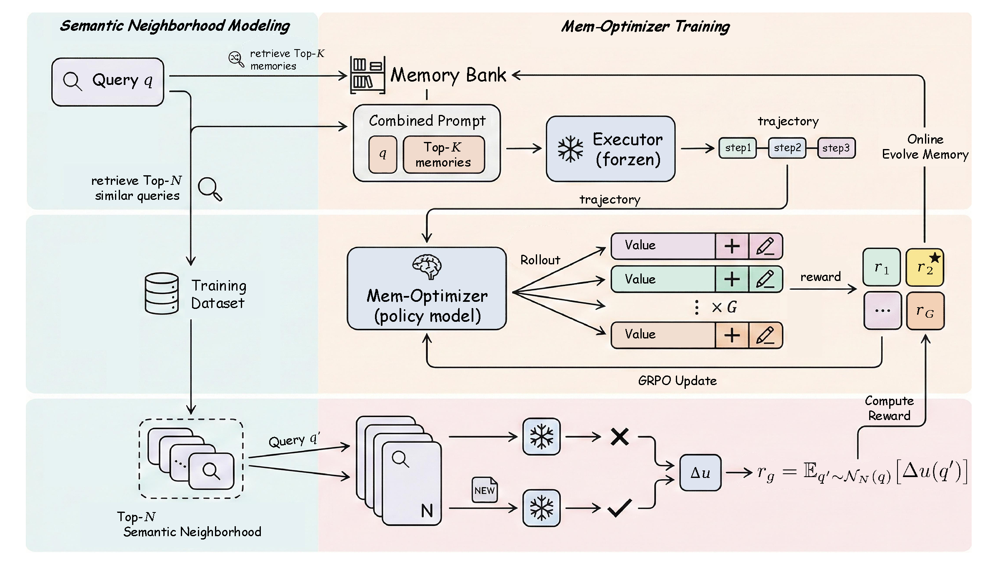

# UMEM: Unified Memory Extraction and Management

[](LICENSE)
[](https://www.python.org/downloads/)
[](https://arxiv.org/abs/2602.10652)

<div align="center">

**Unified Memory Extraction and Management Framework for Generalizable Memory**

[Paper](https://arxiv.org/abs/2602.10652) | [Overview](#overview) | [Method](#method) | [Data](#data) | [Quick Start](#quick-start) | [Citation](#citation)

</div>

---

## Overview

Unified Memory Extraction and Management (UMEM) is a self-evolving agent framework that jointly optimizes a language model to extract and manage reusable memories. UMEM treats the external memory bank as the evolvable state of an agent while keeping the executor model frozen. A learned Mem-Optimizer observes execution trajectories, extracts generalizable experience, and decides how the memory bank should be updated.

To mitigate overfitting to specific instances, UMEM introduces Semantic Neighborhood Modeling and optimizes the Mem-Optimizer with a neighborhood-level marginal utility reward via GRPO. Instead of rewarding a memory only on the current query, UMEM evaluates whether the memory improves execution across semantically related queries, encouraging memories that transfer beyond a single episode.

This repository contains the training code, memory bank implementation, retriever integration, reward manager, SGLang executor launcher, and release data needed to run the UMEM training path.

## Method

<div align="center">
  
  <p><em>Figure 1: UMEM jointly optimizes memory extraction and memory management with Semantic Neighborhood Modeling, marginal utility reward, and online memory evolution.</em></p>
</div>

UMEM consists of three main components:

1. **Agent Executor**: a frozen LLM that solves the task with retrieved memories.
2. **Memory Bank**: an external JSONL + FAISS memory store that is updated online.
3. **Mem-Optimizer**: a trainable policy model that converts executor trajectories into reusable memory and chooses `ADD` or `UPDATE` operations.

During training, the executor first runs on the current query with retrieved memories. The Mem-Optimizer then samples candidate memory updates from the trajectory. UMEM evaluates each candidate memory over a semantic neighborhood of related queries and computes a marginal utility reward. GRPO updates the Mem-Optimizer toward memories that improve neighborhood-level utility, and high-utility rollouts are used to evolve the memory bank.

## Key Features

- **Unified memory optimization**: trains one Mem-Optimizer to both extract reusable experience and choose memory operations.
- **Semantic Neighborhood Modeling**: evaluates candidate memories on semantically related query neighborhoods to reduce instance-specific memorization.
- **Neighborhood-level marginal utility reward**: measures whether a memory improves executor accuracy and efficiency when reused.
- **Online Memory Evolution**: updates the memory bank during training with high-utility rollouts.
- **OpenAI-compatible executor API**: supports SGLang or any service exposing `/v1/chat/completions`.
- **Retriever-backed memory bank**: stores memories in JSONL and builds a FAISS index for retrieval.

## Repository Structure

```text
UMEM/
|-- assets/
|   `-- method.png                 # method overview figure
|-- data/
|   |-- train.parquet              # training split
|   |-- test.parquet               # validation split
|   `-- README.md                  # data schema
|-- scripts/
|   |-- serve_executor_sglang.sh   # OpenAI-compatible SGLang executor
|   `-- train_umem.sh              # UMEM GRPO training entry
|-- verl/
|   |-- umem/                      # memory, executor, prompts, parsing
|   |-- workers/retriever/         # FAISS retriever worker
|   |-- workers/reward_manager/    # UMEM reward manager
|   `-- trainer/                   # PPO/GRPO trainer
|-- requirements.txt               # UMEM training dependencies
`-- requirements-sglang.txt        # SGLang executor dependencies
```

## Installation

UMEM is tested with Python 3.10+. Install a CUDA-compatible PyTorch build for your machine first, then install the repository dependencies.

```bash
cd UMEM

pip install -e .
pip install -r requirements.txt
```

The repository uses two requirements files:

- `requirements.txt`: dependencies for UMEM training, retrieval, dataset loading, FSDP, Ray, Transformers, and vLLM rollout.
- `requirements-sglang.txt`: dependencies for serving the frozen executor model with SGLang.

If `flash-attn`, `vllm`, or FAISS does not match your CUDA/PyTorch environment, install the wheel that matches your local driver and PyTorch version. For GPU FAISS, replace `faiss-cpu` with the package appropriate for your platform.

## Data

This repository includes release data under `data/`:

- `data/train.parquet`: 2,281 training rows
- `data/test.parquet`: 70 validation rows

Each Parquet row is read by `verl.utils.dataset.RLHFDataset` and should contain:

| Field | Description |
| --- | --- |
| `prompt` | Chat-style messages accepted by `tokenizer.apply_chat_template`. |
| `data_source` | Dataset or task name. |
| `reward_model` | Object containing at least `ground_truth`; `style` is also supported. |
| `extra_info` | Object containing `question`; multiple-choice tasks should include `choices`. |

Semantic Neighborhood Modeling uses the following optional lists under `extra_info`:

| Field | Description |
| --- | --- |
| `similar_queries` | Semantically related questions used to evaluate memory generalization. |
| `similar_choices` | Choices for each related question; use empty lists for free-form tasks. |
| `similar_gt` | Ground-truth answers for the related questions. |

The three `similar_*` fields should have matching lengths. If they are omitted or empty, UMEM evaluates memory utility on the current query.

Example:

```json
{
  "prompt": [{"role": "user", "content": "Question text"}],
  "data_source": "mmlu",
  "reward_model": {"style": "rule", "ground_truth": "2"},
  "extra_info": {
    "question": "Question text",
    "choices": ["A", "B", "C", "D"],
    "similar_queries": ["Semantically related question text"],
    "similar_choices": [["A", "B", "C", "D"]],
    "similar_gt": ["2"]
  }
}
```

## Quick Start

### 1. Start an Executor Service

UMEM calls a frozen executor model through an OpenAI-compatible chat-completions endpoint. To serve the executor with SGLang:

```bash
pip install -r requirements-sglang.txt

EXECUTOR_MODEL_PATH=/path/to/executor-model \
SERVED_MODEL_NAME=executor_llm \
HOST=0.0.0.0 \
PORT=8000 \
TENSOR_PARALLEL_SIZE=1 \
DATA_PARALLEL_SIZE=1 \
bash scripts/serve_executor_sglang.sh
```

The script serves requests at:

```text
http://127.0.0.1:8000/v1/chat/completions
```

You can also use any compatible service by setting `EXECUTOR_API_URL` to either the base URL, such as `http://127.0.0.1:8000/v1`, or the full chat-completions endpoint.

### 2. Configure Training

Create a local environment file:

```bash
cp .env.example .env
```

Set the required paths:

```bash
MODEL_PATH=/path/to/policy-model
TRAIN_FILE_PATH=data/train.parquet
TEST_FILE_PATH=data/test.parquet
RETRIEVER_MODEL_PATH=/path/to/retriever-model
EXECUTOR_API_URL=http://127.0.0.1:8000/v1/chat/completions
EXECUTOR_API_CODE=executor_llm
EXECUTOR_AK=EMPTY
```

`MODEL_PATH` is the trainable Mem-Optimizer policy. `EXECUTOR_API_URL` points to the frozen executor service. `RETRIEVER_MODEL_PATH` should point to the embedding model used by the memory retriever.

### 3. Run UMEM Training

```bash
set -a
source .env
set +a

bash scripts/train_umem.sh
```

The default training entry uses GRPO with the UMEM reward manager. The reward configuration keeps a format reward and a memory utility reward:

```bash
EXTRACTOR_W_FORMAT=1.0
EXTRACTOR_W_QUALITY=1.0
```

## Configuration

Common environment variables in `.env.example`:

| Variable | Description | Default |
| --- | --- | --- |
| `N_GPUS` | GPUs per node for training | `8` |
| `WORLD_SIZE` | Number of training nodes | `1` |
| `TRAIN_BATCH_SIZE` | Global training batch size | `128` |
| `ROLLOUT_NUM` | Number of rollout samples per prompt | `8` |
| `EPOCH` | Training epochs | `4` |
| `LR` | Actor learning rate | `1e-6` |
| `RETRIEVER_TOPK` | Number of retrieved memories | `3` |
| `RETRIEVAL_THRESHOLD` | Minimum retrieval similarity threshold | `0.5` |
| `EXECUTOR_MAX_CONCURRENCY` | Maximum concurrent executor calls | `512` |
| `ROLLOUT_GPU_MEMORY_UTILIZATION` | vLLM rollout GPU memory target | `0.8` |

For smaller GPUs, reduce `TRAIN_BATCH_SIZE`, `ROLLOUT_NUM`, and `PPO_MICRO_BATCH_SIZE_PER_GPU`. For larger models, increase `N_GPUS`, set `WORLD_SIZE` for multi-node training, and tune `ROLLOUT_TENSOR_MODEL_PARALLEL_SIZE`.

## Outputs

Training writes each experiment under `outputs/<EXPERIMENT_NAME>/` by default:

```text
outputs/<EXPERIMENT_NAME>/
|-- memory.jsonl        # accepted memory entries
|-- memory.index        # FAISS index for retrieval
|-- rollouts/           # JSONL rollout records
`-- save_ckpts/         # trainer checkpoints
```

`memory.jsonl` stores the evolved memory bank. `memory.index` is rebuilt from the JSONL memory file and used by the retriever worker. Rollout JSONL dumps are enabled by default through `TRAINER_ROLLOUT_SAVE_DIR`.

## Citation

If you find UMEM useful, please cite the arXiv paper:

```bibtex
@misc{ye2026umemunifiedmemoryextraction,
      title={UMEM: Unified Memory Extraction and Management Framework for Generalizable Memory},
      author={Yongshi Ye and Hui Jiang and Feihu Jiang and Tian Lan and Yichao Du and Biao Fu and Xiaodong Shi and Qianghuai Jia and Longyue Wang and Weihua Luo},
      year={2026},
      eprint={2602.10652},
      archivePrefix={arXiv},
      primaryClass={cs.CL},
      url={https://arxiv.org/abs/2602.10652},
}
```

## License

UMEM is released under the Apache-2.0 license. See [LICENSE](LICENSE) and [Notice.txt](Notice.txt).
