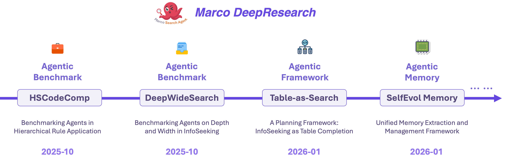
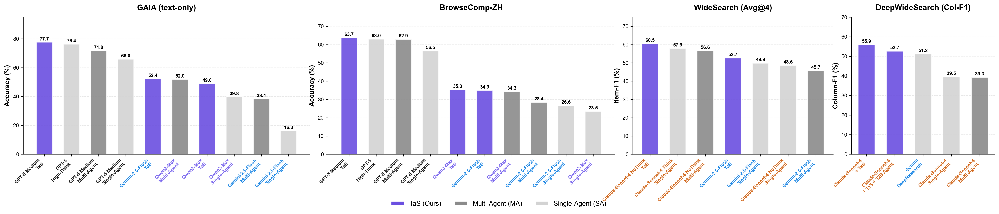
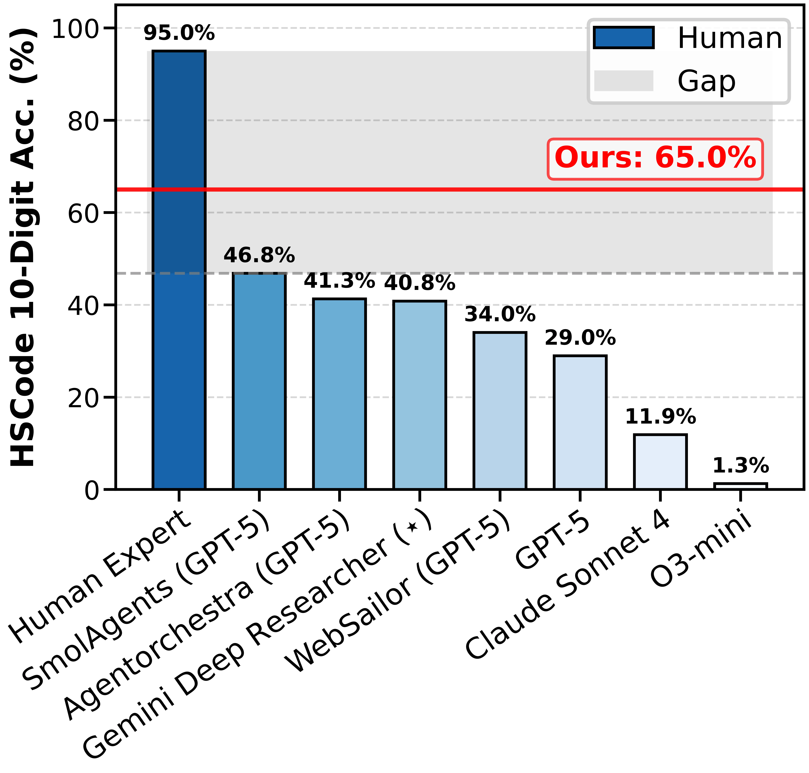
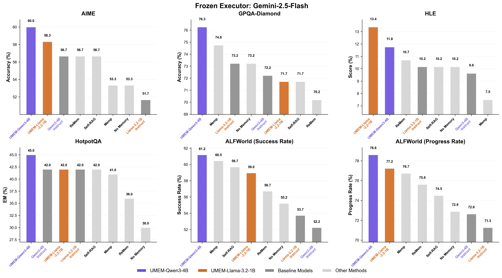

<p align="center">
    
<p>

# 🍓 Marco DeepResearch: Towards Real‑World and Efficient Agents

[]()
[](https://opensource.org/licenses/Apache-2.0)
[](https://www.python.org/downloads/)


 

<div align="center">

🍓 [_**Alibaba International Digital Commerce**_](https://aidc-ai.com) 🍓

📝  [**HSCodeComp Paper**](https://arxiv.org/abs/2510.19631) | 📝  [**DeepWideSearch Paper**](https://arxiv.org/abs/2510.20168) | 🤗  [**HSCodeComp Dataset**](https://huggingface.co/datasets/AIDC-AI/HSCodeComp) | 🤗  [**DeepWideSearch Dataset**](https://huggingface.co/datasets/AIDC-AI/DeepWideSearch)

[English](README.md) | [简体中文](README_zh.md)

</div>

---

## Introduction

**Marco DeepResearch** is a comprehensive initiative from Alibaba International Digital Commerce that advances real-world AI agent capabilities through challenging benchmarks and practical applications. Our work bridges the gap between AI agents and human experts by exposing and addressing critical limitations in domain-specific reasoning, hierarchical rule application, and large-scale information seeking.

<div align="center">
  
</div>

### 🎯 Key Achievements

We introduce a suite of benchmarks and frameworks that evaluate and advance agents across fundamental dimensions essential for real-world deployment:

- **🏆 HSCodeComp**: Tests hierarchical rule application with **95.0% human performance** vs. **46.8% best AI** (SmolAgent + GPT-5 VLM)
- **🏆 DeepWideSearch**: Challenges deep-and-wide information seeking with **414 avg. information units** and **4.21 avg. reasoning depth**
- **🏆 Table-as-Search**: Production-ready hierarchical multi-agent framework demonstrating the **"scissor gap effect"** on challenging benchmarks
- **🏆 UMEM**: Self-evolving memory system that avoids the "rote memorization trap" through joint optimization of memory extraction and management

These benchmarks and frameworks reveal and address fundamental gaps in current AI systems for:
- Complex hierarchical decision-making in vertical domains (tariff, legal, medical, taxation)
- Simultaneous wide-scale exploration and deep multi-hop reasoning
- Structured information organization and synthesis
- Generalizable long-term memory that evolves without overfitting

---

## 🔥 News & Updates

* **[2026-02]** 🎉 Released **UMEM (Unified Memory Extraction and Management)** - a self-evolving memory framework that jointly optimizes extraction and management for generalizable agent memory.
* **[2025-02]** 🏆 **DeepWideSearch**: **[A-MapReduce](https://arxiv.org/pdf/2602.01331)** uses DeepWideSearch as the primary benchmark for wide-search systems, achieving **79.09% Core Entity Accuracy**, **51.78% Column F1**, and **4.43% Success Rate** (SOTA among open-source frameworks), Setting new standards for evaluating agentic search capabilities with reproducible metrics
* **[2025-10]** 🔥 Initial release of Marco DeepResearch with **DeepWideSearch** and **HSCodeComp** benchmarks.

---

## 🌟 Marco DeepResearch in Practice

Real-world deployment showcases how our research frameworks address critical challenges in Alibaba International Digital Commerce Group's business scenarios.

---

### 📊 Business Development (BD) Intelligence

**Challenge:** BD tasks require both **breadth** (finding many qualified merchants across platforms) and **depth** (multi-hop extraction of contact details from official sites). ReAct-style baselines suffer from unclear planning, state confusion, and coverage gaps on the [DeepWideSearch](Marco-DeepResearch-Family/DeepWideSearch/) benchmark.

**Our Solution: Table-as-Search** — We formalize long-horizon search as **table completion**: explicit state tracking, clear planning from the partially-filled table, and hierarchical orchestration of Wide (tabular) and Deep (multi-hop) sub-agents.

**Results:** On our real-world scenario Business Development datasets, Table-as-Search delivers **40%+ gain** on hard tasks (Success Rate 15.2% → 55.8%), with Entity Recall 89.3% (vs. 62.1%) and Attribute Completeness 85.7% (vs. 58.4%). Deployed in BD workflows, it significantly improves the working efficiency.

<div align="center">
  
  <p><em><b>Performance across task difficulties:</b> Table-as-Search (blue) vs. Multi-Agent ReAct (orange) and Single-Agent (gray) baselines.</em></p>
</div>

---

### 🏷️ HSCode Classification for Cross-Border Trade

**The Problem: Hierarchical Rule Application in a Vertical Domain**

Predicting a destination country’s 10-digit HS code and tariff from incomplete product information (e.g., from an ERP or catalog) requires **hierarchical rule application**: tariff rules have vague boundaries and implicit logic, making precise application challenging for agents. See our benchmark paper [HSCodeComp](assets/HSCodeComp.pdf) for task formulation and related work.

**Our Approach: Benchmark First, Then Tool-Augmented Agents**

We first established the **HSCodeComp** benchmark and found that state-of-the-art agents perform poorly—far below human experts. We then designed an agent-based framework with Marco as the orchestrator: (1) **multi-modal input parsing** (titles, attributes, images → normalized attributes), (2) **retrieval-augmented reasoning** via Deep Search (historical labels, expert knowledge, customs rulings), (3) **tool-integrated verification** (tariff lookup, chapter/section notes, ruling validation), and (4) **structured output** with an auditable evidence trail.

**Results: Clear Gain vs. Baselines, Large Gap vs. Humans**

On 10-digit HS code accuracy, Marco Agent reaches **65.0%** Top-1, outperforming GPT-5–based agents (46.8%), Agentorchestra (41.3%), and Claude Sonnet 4 (11.9%). As shown below, tool-augmented decision-making substantially improves over general-purpose agents. Nevertheless, a large gap remains versus human experts (95.0%), indicating **significant room for further improvement**.

<div align="center">
  
  <p><em><b>HSCodeComp benchmark (10-digit accuracy):</b> Marco Agent (65.0%) vs. baselines and human experts (95.0%).</em></p>
</div>

---

### 💬 Customer Service Intelligence (Self-Evolving Agent)

**The Problem: Rules Are Subtle and Shifting**

In e-commerce commodity auditing are multi-modal, subtle, and constantly evolving. When the agent’s decision disagrees with expert labels (e.g., misidentifying a branded product as "counterfeit"), fixing behavior used to require **3–5 days of manual tuning**.

**Our Approach: Self-Evolving Agent + UMEM**

The **Self-Evolving Agent** learns from the gap between agent judgment and expert ground truth: it extracts nuances and integrates them into long-term memory. The engine is **UMEM** (Unified Memory Extraction and Management), which distills interaction traces into actionable and generalizable insights instead of merely retrieving past data. The loop is **Action → Rewarding** (compare with ground truth, detect badcases) **→ Memory Extraction** (reflect, generate candidate rules) **→ Validation** (safety gate, then update memory or retry).

**Results: 30–50× Faster Tuning, Quality Gains**

The workflow is compressed from 3–5 days to a **~10-minute autonomous cycle**. The self-evolving agent outperforms human-optimized baselines by **+11%** on white-background image auditing and **+2%** on short title review. On benchmarks, **UMEM** consistently outperforms state-of-the-art memory baselines (ReMem, Memp) across environments.
Besides, we also evaluate our UMEM on other reasoning benchmarks (below figure). Extensive experimental results demonstrate that our proposed UMEM could learn highly generalizable memory that improves the performance of future tasks.

<div align="center">
  
  <p><em><b>UMEM vs. baselines</b> (e.g., Gemini 2.5 Flash setting): UMEM improves performance across evaluation setups.</em></p>
</div>

---

## 📦 Resource Download

### Datasets

| Benchmark | HuggingFace | GitHub | Paper |
|-----------|-------------|--------|-------|
| **HSCodeComp** | [🤗 AIDC-AI/HSCodeComp](https://huggingface.co/datasets/AIDC-AI/HSCodeComp) | [📁 HSCodeComp/data](Marco-DeepResearch-Family/HSCodeComp/data/test_data.jsonl) | [📝 arXiv](https://arxiv.org/abs/2510.19631) |
| **DeepWideSearch** | [🤗 AIDC-AI/DeepWideSearch](https://huggingface.co/datasets/AIDC-AI/DeepWideSearch) | [📁 DeepWideSearch/data](Marco-DeepResearch-Family/DeepWideSearch/data/) | [📝 arXiv](https://arxiv.org/abs/2510.20168) |
| **Table-as-Search** | [🤗 Table-as-Search Paper](https://huggingface.co/papers/2602.06724) | [📁 Table-as-Search Codebase](Marco-DeepResearch-Family/Table-as-Search/) | [📝 arXiv](https://arxiv.org/abs/2602.06724) |
| **UMEM** | [🤗 UMEM Paper](https://huggingface.co/papers/2602.06724) | [📁 UMEM Codebase](Marco-DeepResearch-Family/UMEM/) | [📝 arXiv](https://arxiv.org/abs/2602.10652) |

---

## 🚀 Quick Start

### Repository Structure

```
Marco-DeepResearch/
├── Marco-DeepResearch-Family/   # Unified directory for all projects
│   ├── HSCodeComp/              # Hierarchical rule application benchmark
│   │   ├── data/                # 632 expert-annotated product samples
│   │   ├── eval/                # Evaluation scripts
│   │   └── README.md
│   ├── DeepWideSearch/          # Deep-and-wide information seeking benchmark
│   │   ├── data/                # 220 complex multi-hop queries
│   │   ├── eval/                # Evaluation scripts
│   │   ├── scripts/             # Batch evaluation tools
│   │   └── README.md
│   ├── Table-as-Search/         # Hierarchical multi-agent framework
│   │   ├── tools/               # Core tool implementations
│   │   ├── prompts/             # Agent prompt templates
│   │   └── README.md
│   ├── UMEM/                    # Self-evolving memory system
│   │   ├── verl/                # Core source code
│   │   ├── umem_scripts/        # Training and evaluation scripts
│   │   └── README.md
│   ├── README.md                # Family overview (English)
│   └── README_zh.md             # Family overview (Chinese)
├── assets/                      # Shared resources and visualizations
└── README.md                    # Main project README
```

### Installation

Each project has its own dependencies. Navigate to the specific project directory:

```bash
# For HSCodeComp
cd Marco-DeepResearch-Family/HSCodeComp
pip install -r requirements.txt

# For DeepWideSearch
cd Marco-DeepResearch-Family/DeepWideSearch
pip install -r requirements.txt

# For Table-as-Search
cd Marco-DeepResearch-Family/Table-as-Search
pip install -r requirements.txt

# For UMEM
cd Marco-DeepResearch-Family/UMEM
pip install -r requirements.txt
pip install -e .
```

### Running Evaluations

**HSCodeComp**:
```bash
cd Marco-DeepResearch-Family/HSCodeComp
python eval/test_llm.py \
  --model_name your_model \
  --data_path data/test_data.jsonl \
  --output_path results/
```

**DeepWideSearch**:
```bash
cd Marco-DeepResearch-Family/DeepWideSearch
bash scripts/batch_eval.sh
```

**Table-as-Search**:
```bash
cd Marco-DeepResearch-Family/Table-as-Search
python run_widesearch_inference.py --query "your query" --instance-id "test_001"
```

**UMEM**:
```bash
cd Marco-DeepResearch-Family/UMEM
bash umem_scripts/run_eval.sh
```

For detailed setup and usage instructions, please refer to:
- [HSCodeComp README](Marco-DeepResearch-Family/HSCodeComp/README.md) - Hierarchical rule application evaluation
- [DeepWideSearch README](Marco-DeepResearch-Family/DeepWideSearch/README.md) - Deep-wide search evaluation
- [Table-as-Search README](Marco-DeepResearch-Family/Table-as-Search/README.md) - Framework usage and deployment
- [UMEM README](Marco-DeepResearch-Family/UMEM/README.md) - Memory system training and evaluation

---

## 🌟 Marco DeepResearch Family

The Marco DeepResearch initiative encompasses multiple benchmarks and frameworks addressing distinct challenges in real-world agent systems. Visit our [**Marco DeepResearch Family**](Marco-DeepResearch-Family/README.md) directory for detailed information about each project:

- **📑 [HSCodeComp](Marco-DeepResearch-Family/HSCodeComp/README.md)**: Hierarchical rule application in e-commerce domain
- **🌐 [DeepWideSearch](Marco-DeepResearch-Family/DeepWideSearch/README.md)**: Deep-and-wide agentic information seeking
- **📊 [Table-as-Search](Marco-DeepResearch-Family/Table-as-Search/README.md)**: Production-ready hierarchical multi-agent framework
- **🧠 [UMEM](Marco-DeepResearch-Family/UMEM/README.md)**: Unified memory extraction and management for self-evolving agents

<div align="center">
  <a href="Marco-DeepResearch-Family/README.md">
    
  </a>
</div>

---

## 👨🏻‍💻 Acknowledgements

Main contributors are from AI Business, Alibaba International Digital Commerce. For questions or collaboration, please contact:
- [Tian Lan](https://github.com/gmftbyGMFTBY)
- [Longyue Wang](https://www.longyuewang.com/)

**Special Thanks**:
- **HSCodeComp**: Human tariff experts for meticulous annotation (hourly wage: >$34/hr)
- **DeepWideSearch**: Built upon the open-source [WideSearch](https://github.com/ByteDance-Seed/WideSearch) framework by ByteDance-Seed (MIT License)

---

## 🛡️ License

This project is licensed under the **Apache-2.0 License**. See [LICENSE](LICENSE) for details.

---

## ⚠️ Disclaimer

Our datasets are constructed using publicly accessible data sources:
- **HSCodeComp**: Product data from real e-commerce platforms
- **DeepWideSearch**: Built upon [BrowseComp](https://openai.com/index/browsecomp/), [BrowseComp-ZH](https://arxiv.org/abs/2504.19314), and [WideSearch](https://github.com/ByteDance-Seed/WideSearch) datasets

Due to the complexity of these tasks and diverse data sources, we cannot guarantee complete freedom from copyright issues or improper content. If you believe anything infringes on your rights or generates improper content, please contact us for prompt resolution.

---

## 📬 Citation

If you find our work useful, please consider citing:

```bibtex
@article{lan2024hscodecomp,
  title={HSCodeComp: Evaluating Hierarchical Rule Application in E-Commerce Domain},
  author={Lan, Tian and Wang, Longyue and others},
  journal={arXiv preprint arXiv:2510.19631},
  year={2024}
}

@article{lan2024deepwidesearch,
  title={DeepWideSearch: Benchmarking Depth and Width in Agentic Information Seeking},
  author={Lan, Tian and Wang, Longyue and others},
  journal={arXiv preprint arXiv:2510.20168},
  year={2024}
}

@misc{lan2026tableassearchformulatelonghorizonagentic,
      title={Table-as-Search: Formulate Long-Horizon Agentic Information Seeking as Table Completion}, 
      author={Tian Lan and Felix Henry and Bin Zhu and Qianghuai Jia and Junyang Ren and Qihang Pu and Haijun Li and Longyue Wang and Zhao Xu and Weihua Luo},
      year={2026},
      eprint={2602.06724},
      archivePrefix={arXiv},
      primaryClass={cs.CL},
      url={https://arxiv.org/abs/2602.06724}, 
}

@misc{ye2026umemunifiedmemoryextraction,
      title={UMEM: Unified Memory Extraction and Management Framework for Generalizable Memory}, 
      author={Yongshi Ye and Hui Jiang and Feihu Jiang and Tian Lan and Yichao Du and Biao Fu and Xiaodong Shi and Qianghuai Jia and Longyue Wang and Weihua Luo},
      year={2026},
      eprint={2602.10652},
      archivePrefix={arXiv},
      primaryClass={cs.CL},
      url={https://arxiv.org/abs/2602.10652}, 
}
```
